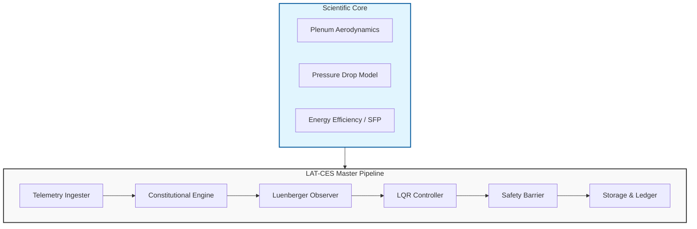

# LAT-CES (Logic, Architecture, Telemetry - Constitutional Ecosystem)

LAT-CES je modularni sistem za upravljanje fizickim i sajber-fizickim procesima, dizajniran sa fokusom na **ustavnu guverneranu** (Constitutional Governance), naucnu validaciju i real-time kontrolu.

## 🏗️ Arhitektonski Pregled

Sistem je organizovan u 8 temeljnih talasa, objedinjenih kroz `Master Integration Pipeline`.

